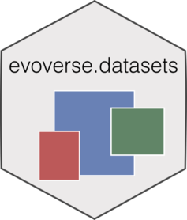

```{r, include = FALSE}
knitr::opts_chunk$set(
  collapse = TRUE,
  comment = "#>",
  fig.path = "man/figures/README-",
  out.width = "100%"
)
```


# evoverse.datasets 

<!-- badges: start -->

[](https://travis-ci.org/caravagn/CNAqc)
[](https://www.tidyverse.org/lifecycle/#maturing)
[](https://caravagn.github.io/evoverse)
<!-- badges: end -->


The `evoverse.datasets` package contains datasets and analysis computed with the 
packages of `evoverse` [package](https://caravagn.github.io/evoverse), a collection of algorithms
to carry out Canver Evolution analysis from tumour sequencing data.

#### Usage

When you load the package - `library(evoverse.datasets)` - the datasets currently available are shown. 
Use `available_data()` to print out the summary again.

Example: to load dataset `'TRACERx_NEJM_2017'` use `data('TRACERx_NEJM_2017', package='evoverse.datasets')`.

-----

### Installation

You can install the released version of `evoverse.datasets` from
[GitHub](https://github.com/) with:

``` r
# install.packages("devtools")
devtools::install_github("caravagn/evoverse.datasets")
```

-----

#### Copyright and contacts

Giulio Caravagna, PhD. _Institute of Cancer Research, London, UK_.

[](mailto:gcaravagn@gmail.com)
[](https://github.com/caravagn)
[](https://twitter.com/gcaravagna)
[](https://sites.google.com/site/giuliocaravagna/)
